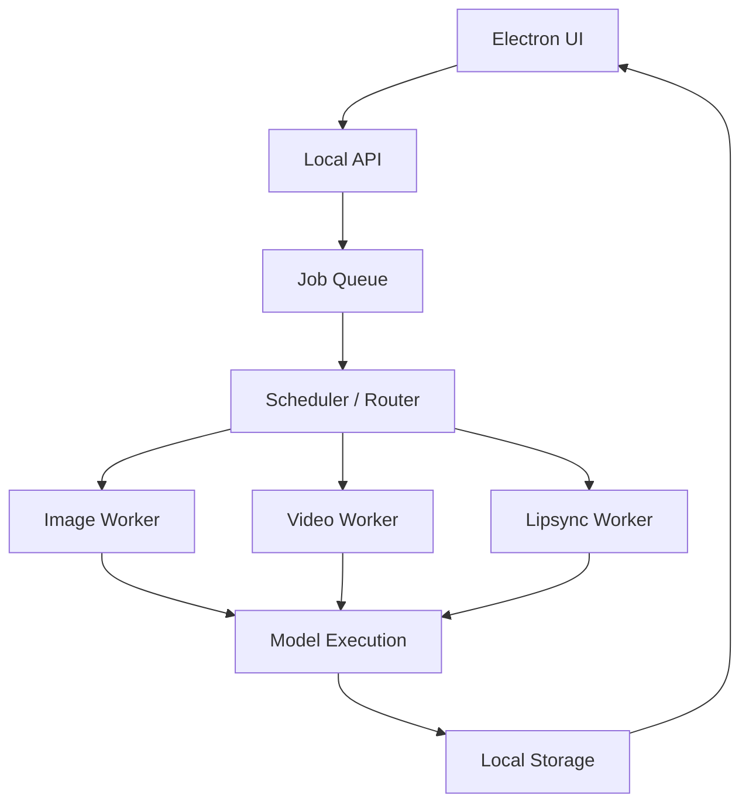

# Open Higgsfield AI — Local AI Generation Studio

> **A self-hosted AI image & video generation studio with full local control and GPU-powered execution. No external inference APIs. No Subscriptions. Just Raw Intelligence.**

---

## 🏗️ Project Status: Architectural Transition

Open Higgsfield AI is currently evolving from an **API-dependent frontend** into a **fully local AI workstation**.

- **UI Layer:** ✅ Substantially Complete (Image, Video, Lip Sync, Cinema Studios)
- **Backend API:** 🚧 In-Transition (Moving to local Job System)
- **Local Execution:** ❌ In-Progress (Worker & Model integration phase)

---

## 🧩 Model Registry (Planned)

Models in Open Higgsfield AI are not hardcoded; they are defined via a central registry that manages:

- **Model Identity:** Name, version, and task type (t2i, t2v, lipsync).
- **Schema:** Required inputs, parameters, and default values.
- **Execution:** Target worker, hardware requirements (VRAM), and quantization state.

This registry enables plug-and-play model integration and allows users to swap between different open-weight backends effortlessly.

---

## 🧬 Model Ecosystem (Execution Targets)

Open Higgsfield AI supports **pluggable model backends**. The models listed below represent our primary **target integrations** for the local inference pipeline.

### 🖼️ Image Intelligence (T2I / I2I)
| Capability | Target Models |
| :--- | :--- |
| **High-Fidelity Generation** | Flux-family models |
| **Fast Iteration** | Distilled / quantized variants |
| **Editing & Consistency** | ControlNet / IP-Adapter / Redux-style pipelines |

### 🎬 Video Generation (T2V / I2V)
| Capability | Target Models |
| :--- | :--- |
| **Cinematic Video** | Wan-family models |
| **Motion Simulation** | Hunyuan-style pipelines |
| **Video Extension** | Temporal continuation models |

### 🎙️ Lip Sync & Animation
| Capability | Target Models |
| :--- | :--- |
| **Talking Heads** | LivePortrait-style systems |
| **Lipsync** | LTX-style pipelines |
| **Speech Animation** | Audio-conditioned video models |

---

## 🧱 System Architecture

---

## 📦 Data & Asset Flow

All media is handled locally to ensure privacy and performance:

1. **User input** → Stored in `/assets/input`
2. **Job created** → References specific local file paths
3. **Worker** → Loads assets directly from disk (No network overhead)
4. **Output** → Saved to `/assets/output`
5. **UI** → Reads and displays results from local storage

---

## 🚀 Development Roadmap

### Phase 1 — Control Plane (Current)
- Remove MuAPI and external API key requirements.
- Implement the local `/jobs` API structure in `backend/server.py`.
- Wire `ImageStudio` and `VideoStudio` to the local job system.

### Phase 2 — Local Execution
- Integrate first local workers (Flux/Wan).
- Implement file-based asset handoff between Electron and Python.
- Remove all external inference calls.

### Phase 3 — Pro Scaling
- Multi-GPU worker support.
- Model orchestration (Scheduler/Router) for load balancing.
- Hybrid execution modes (Local + Remote GPU fallback).

---

## 🧭 Philosophy

> **Don't rent intelligence. Own the pipeline.**

---

## 📄 License

MIT
